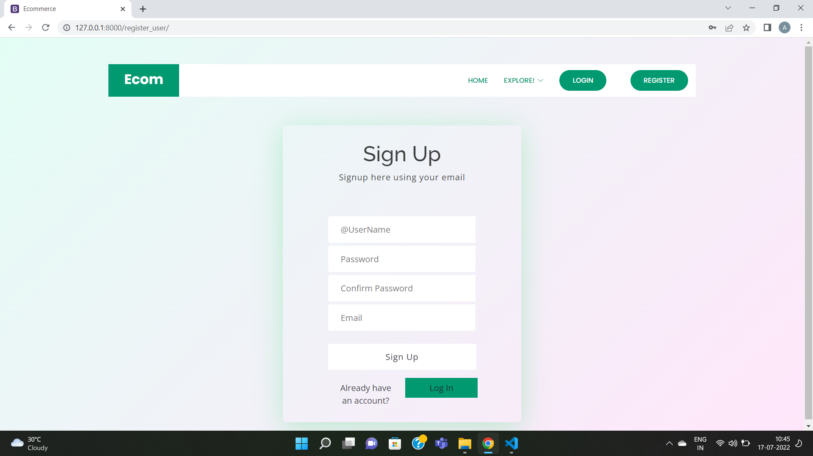

# E-Commerce-Website

◦ A user-friendly website that allows authenticated users to purchase and add products to the website. 
◦ The back-end was built on Django web framework and the front-end is mainly based on HTML,CSS and javascript.

## Preview
<h4> Home Page </h4>

<h4> Login Page </h4>

<h4> Signup Page </h4>

<h4> Products Page </h4>

<h4> Cart Page </h4>

<h4> Checkout Page </h4>

# Usage

First clone the repository from Github.
Activate the virtualenv (if any) for your project.
    
Install project dependencies:

    $ python -m pip install --upgrade pip
    $ pip install -r requirements.txt
    
    
Then simply apply the migrations:

    $ python manage.py makemigrations
    $ python manage.py migrate
    

You can now run the development server:

    $ python manage.py runserver
You can access the default local server at http://127.0.0.1:8000/
